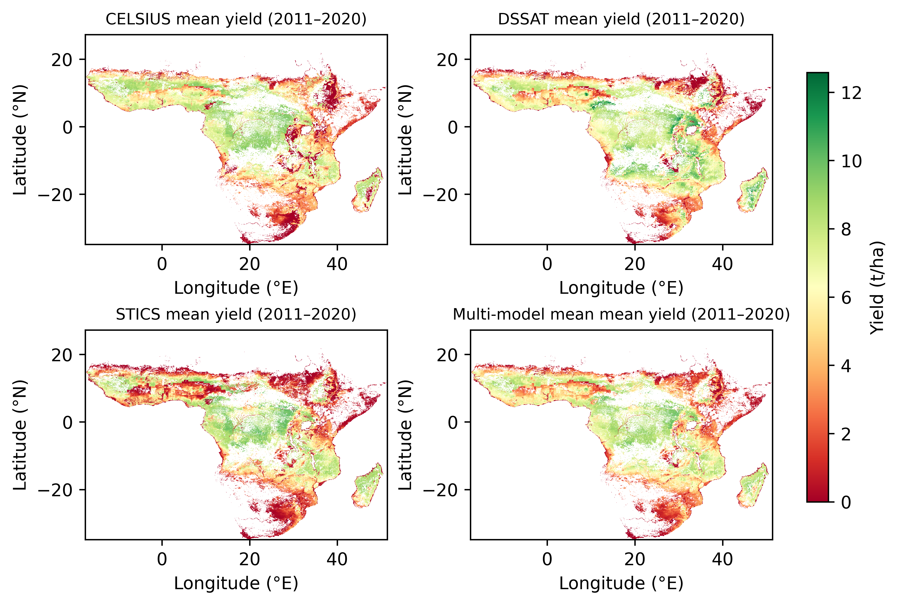

# AgriScale

> **A distributed framework for large-scale, spatially explicit ensemble crop model simulations**

AgriScale orchestrates the end-to-end execution of gridded soil-crop simulations over large spatial domains using adaptive domain partitioning, hierarchical parallelism, and Singularity/Apptainer containers. It enables multi-model ensemble runs across heterogeneous computing environments — HPC clusters, cloud platforms, or local servers — without modifying the original model implementations.

---

## Table of Contents

- [AgriScale](#agriscale)
  - [Table of Contents](#table-of-contents)
  - [Key Features](#key-features)
  - [Architecture](#architecture)
  - [Integrated Models](#integrated-models)
  - [Getting Started](#getting-started)
    - [Prerequisites](#prerequisites)
    - [Get the Container](#get-the-container)
    - [Data Setup](#data-setup)
  - [Configuration](#configuration)
  - [Running Simulations](#running-simulations)
    - [HPC Cluster (SLURM)](#hpc-cluster-slurm)
    - [HPC Cluster (PBS/Torque)](#hpc-cluster-pbstorque)
    - [Local Server or Cloud VM](#local-server-or-cloud-vm)
    - [Singularity Bind Mounts](#singularity-bind-mounts)
  - [Input Database Schema](#input-database-schema)
  - [Example Output](#example-output)
  - [Performance Notes](#performance-notes)
  - [Citation](#citation)
  - [License](#license)

---

## Key Features

- **Multi-model support** — run CELSIUS, DSSAT, and STICS in a unified workflow without modifying their source code
- **Adaptive spatial partitioning** — automatic domain decomposition into balanced subdomains for dynamic load balancing
- **Hierarchical parallelism** — combines inter-task distributed execution with intra-task multiprocessing; compatible with any job scheduler or manual parallelism
- **I/O optimization** — application-level caching and two storage strategies (shared storage and node-local) to reduce file-system contention
- **Container-based portability** — all models and dependencies are packaged in a single Singularity SIF image (`datamill.sif`)
- **SQLite-backed data management** — lightweight relational database (`MasterInput.db`) structures simulation units, soil, climate, cultivar, and management inputs
- **Flexible crop management** — supports spatialized sowing dates, fertilization scenarios, varieties, and irrigation from configuration or gridded files

---

## Architecture

AgriScale divides a spatial domain into a regular grid and partitions grid cells into subdomains using row-major ordering with near-equal load balancing (see Appendix A in the paper). Each task processes one subdomain and can be dispatched by any job scheduler or run manually in parallel:

```
User specifies domain (bounding box + resolution)
        │
        ▼
Spatial domain partitioning  ──►  N subdomains  (one task per subdomain)
        │
        ▼  (per subdomain task)
┌─────────────────────────────────────────────┐
│  1. Build simulation list from MasterInput  │
│  2. Generate model-specific input files     │  ◄── local cache (climate, cultivars)
│  3. Execute model(s) with multiprocessing   │
│  4. Parse and aggregate outputs             │
│  5. Write results to /outputData            │
└─────────────────────────────────────────────┘
```

Two I/O strategies are supported:
- **Shared Storage Strategy (SSS)** — model I/O written directly to the shared file system (suitable for WekaFS or fast parallel FS)
- **Node Locality Strategy (NLS)** — I/O staged to a fast local temporary directory (`$TMPDIR`), then results are copied back (recommended for ZFS/EXT4 file systems)

---

## Integrated Models

| Model   | Language     | Reference |
|---------|-------------|-----------|
| CELSIUS | Visual Basic | Ricome et al., 2017 |
| DSSAT   | Fortran      | Hoogenboom et al., 2019 |
| STICS   | Fortran      | Brisson et al., 2009 |

Models are invoked via model adapters that handle input generation, executable invocation, and output parsing, keeping the core simulation pipeline model-agnostic.

---

## Getting Started

### Prerequisites

- **Singularity** (≥ 3.x) or **Apptainer** (≥ 1.x) installed on your compute environment
- A compute environment — any of the following:
  - HPC cluster with SLURM, PBS/Torque, LSF, or similar scheduler
  - Cloud VM (AWS, GCP, Azure) or virtual cluster
  - Local multi-core server or workstation
- Input datasets: gridded climate (NetCDF/Zarr), soil, and optionally sowing date rasters at consistent spatial resolution
- A populated `MasterInput.db` SQLite database (see [Input Database Schema](#input-database-schema))

### Get the Container

Download the pre-built `datamill.sif` container from the latest release of [AgriscaleContainer](https://github.com/CropModelingPlatform/AgriscaleContainer/releases/latest):

```bash
bash scripts/download_container.sh
```

This downloads `datamill.sif` directly from the GitHub Release asset — no authentication required for a public repository. To pin a specific version:

```bash
AGRISCALE_VERSION=v1.2.0 bash scripts/download_container.sh
```

For private repositories, set `GITHUB_TOKEN` beforehand:

```bash
export GITHUB_TOKEN=ghp_your_token_here
bash scripts/download_container.sh
```

### Data Setup

Organize your data as follows (paths are mapped via Singularity bind mounts):

```
/inputData/          # gridded input data (climate NetCDF/Zarr, soil, sowing dates)
/package/            # AgriScale repository root (this directory)
  config.ini
  scripts/
  db/
    MasterInput.db
  data/
  datamill.sif
/inter/              # intermediate files and simulation outputs
/outputData/         # final aggregated results
$TMPDIR/             # fast node-local scratch (for NLS strategy)
```

---

## Configuration

All simulation options are controlled by `config.ini` in the repository root. Key sections:

| Section | Key Parameters | Description |
|---------|---------------|-------------|
| `[spatialized_features]` | `s_variety`, `s_fert`, `s_sowing`, `s_irr`, `s_density` | Toggle spatially explicit management inputs |
| `[variety_settings]` | `variety_dict`, `variety` | Map raster variety codes to cultivar IDs |
| `[model_options]` | `models` | Models to run: `("celsius")`, `("stics" "celsius" "dssat")` |
| `[sowing_options]` | `SD`, `SW` | Sowing date mode: `0`=fixed, `1`=from CELSIUS output, `3`=list of DOYs, `4`=gridded file |
| `[simulation_options]` | `simoption` | `1`=WS+NS, `2`=WS only, `3`=NS only, `4`=Potential |
| `[simulation_dates]` | `startd`, `endd`, `start_sowing`, `end_sowing` | Simulation window (day-of-year or days relative to sowing) |
| `[soil_settings]` | `textclass`, `soilTextureType` | Use gridded soil texture file or a fixed global texture class |
| `[extraction_options]` | `doExtract`, `bound` | Optionally extract a sub-region bounding box `(lon_min lat_min lon_max lat_max)` |
| `[crop_mask_options]` | `cropmask` | Apply a crop mask raster |
| `[fertilization_options]` | `fertioption` | Fertilization scenario codes from `CropManagement` table |

Example: run CELSIUS and STICS with gridded sowing dates for all varieties:

```ini
[model_options]
models=("celsius" "stics")

[sowing_options]
SD=1

[simulation_options]
simoption=(2)
```

---

## Running Simulations

Each simulation is split into `N` spatial subdomains (controlled by the `parts` parameter in `config.ini`). One task is launched per subdomain; tasks are independent and can be dispatched by any scheduler or run manually.

### HPC Cluster (SLURM)

```bash
sbatch --array=0-<N-1> datamill.sh
```

For example, for 15 subdomains:

```bash
sbatch --array=0-14 datamill.sh
```

Key SLURM parameters in `datamill.sh` (edit to match your cluster):

```bash
#SBATCH --cpus-per-task=8     # cores per task (intra-task multiprocessing)
#SBATCH --mem=64G
#SBATCH --time=23:58:00
#SBATCH --partition cpu-dedicated
```

### HPC Cluster (PBS/Torque)

Adapt `datamill.sh` to PBS directives and use a job array:

```bash
#PBS -l select=1:ncpus=8:mem=64gb
#PBS -l walltime=23:58:00
#PBS -J 0-14

export INDEXES=$PBS_ARRAY_INDEX
export ncpus=8
export nchunks=15
```

Submit with:
```bash
qsub -J 0-14 datamill.sh
```

### Local Server or Cloud VM

On a machine with no job scheduler, launch tasks in parallel using `xargs` or GNU `parallel`:

```bash
# Run 4 subdomains in parallel on a server with 32 cores (8 cpus each)
seq 0 3 | xargs -P 4 -I{} bash -c '
  export INDEXES={} ncpus=8 nchunks=4
  singularity exec --no-home \
    -B $(pwd):/package \
    -B /path/to/inputData:/inputData \
    -B /path/to/results:/inter \
    -B /path/to/results:/outputData \
    datamill.sif /package/scripts/main.sh $INDEXES $ncpus $nchunks
'
```

On a **cloud VM** (AWS EC2, GCP, Azure), the same command applies — mount your object storage bucket or NFS share to `/inputData` and `/outputData` before running.

### Singularity Bind Mounts

The container is launched with the following bind mounts (adapt paths to your environment):

| Mount inside container | Example host path | Purpose |
|------------------------|------------------|---------|
| `/package` | `/path/to/AgriScale` | AgriScale working directory |
| `/inputData` | `/path/to/data` | Input climate/soil data |
| `/inter` | `/path/to/results` | Intermediate files |
| `/outputData` | `/path/to/results` | Final outputs |
| `$TMPDIR` | `/tmp/$USER` | Fast local scratch (NLS strategy) |

**Examples by environment:**

- **HPC with SLURM/PBS**: use the scheduler-provided scratch space, e.g. `/scratch/$USER/…`
- **Cloud VM (AWS/GCP/Azure)**: mount an NFS share, EFS, or object-storage FUSE path
- **Local server**: use any directory on the host, e.g. `$(pwd)/results`

Edit the `singularity exec` command in `datamill.sh` to match your paths.

---

## Input Database Schema

Simulations are driven by a **MasterInput SQLite database** (`db/MasterInput.db`). The key tables are:

| Table | Description |
|-------|-------------|
| `SimulationUnit` | One row per grid cell; links climate, soil, and management records |
| `CropManagement` | Crop management practices (sowing date, density, fertilization, irrigation) |
| `Cultivar` | Cultivar parameter sets per model |
| `Soil` | Soil profile data per grid cell |
| `Climate` | References to gridded climate files or records |

When spatially explicit management is enabled (`s_sowing=1`, etc.), AgriScale automatically regenerates the `CropManagement` table with unique identifiers encoding the grid cell and scenario.

A template schema is provided in `db/ori_MasterInput.db`.

---

## Example Output

The map below shows 2011–2020 mean simulated water-limited maize yields over Sub-Saharan Africa at 0.05° resolution, produced by a multi-model AgriScale run with CELSIUS, DSSAT, and STICS (11,490,195 simulations total).



---

## Performance Notes

Benchmark results from the paper (3,830,650 simulations per model over Sub-Saharan Africa at 0.05° resolution):

- Speedup can be super linear when applying AgriScale strategy based on the caching and Node locality strategies.
- Job efficiency (resource utilization) ranges from **70–92%** across HPC environments and I/O strategies
- The **Node Locality Strategy** (staging I/O to `$TMPDIR`) is strongly recommended for ZFS and EXT4 file systems to avoid shared file-system contention

---

## Citation

If you use AgriScale in your work, please cite:

> Midingoyi, C. A., Falconnier, G. N., Blitz-Frayret, C., Pradal, C., Giner, M., Adam, M., Corbeels, M., Couëdel, A., Heuclin, B., Lavarenne, J., Gerardeaux, E., Loison, R., Agbohessou, Y., et al. (2025). *AgriScale: A Distributed Framework for Gridded Crop Models Ensemble applications*. Manuscript submitted for publication.

The current version of the software is defined in [`version.py`](version.py). Releases are published automatically on GitHub when the version changes. A DOI will be assigned via Zenodo upon journal acceptance.

---

## License

This project is licensed under the terms of the [LICENSE](LICENSE) file included in this repository.

